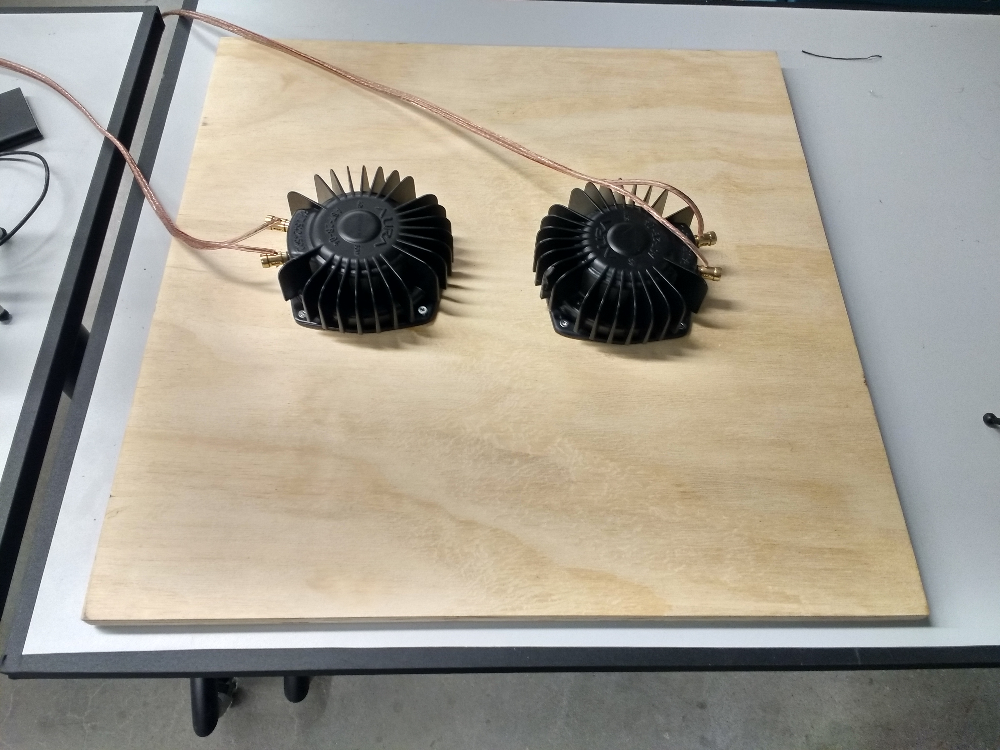
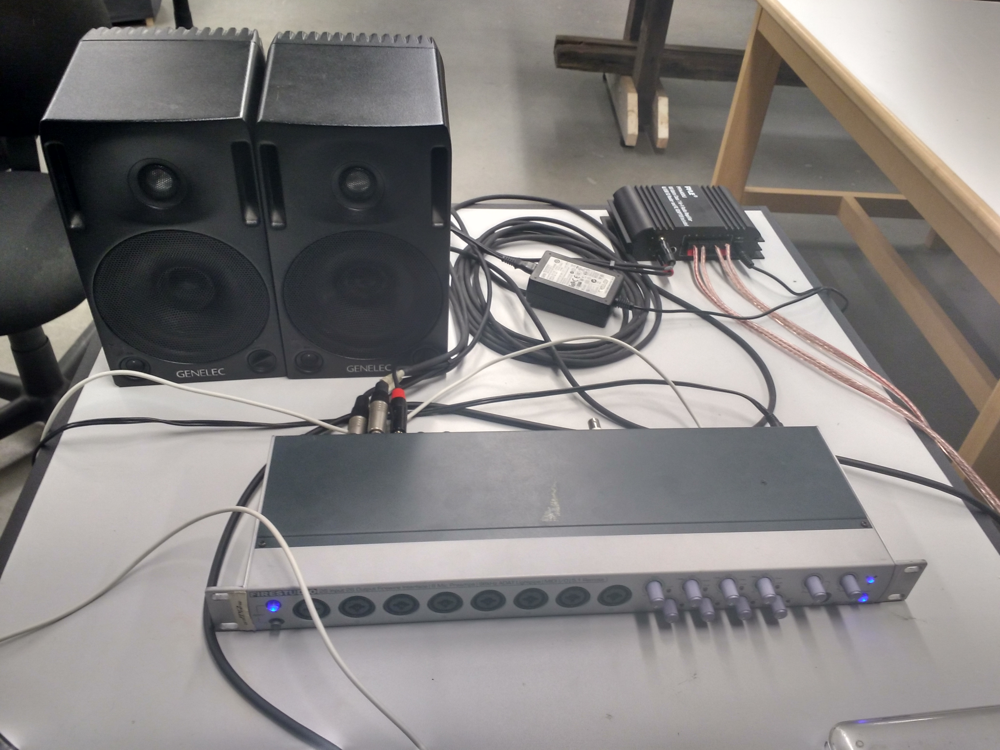
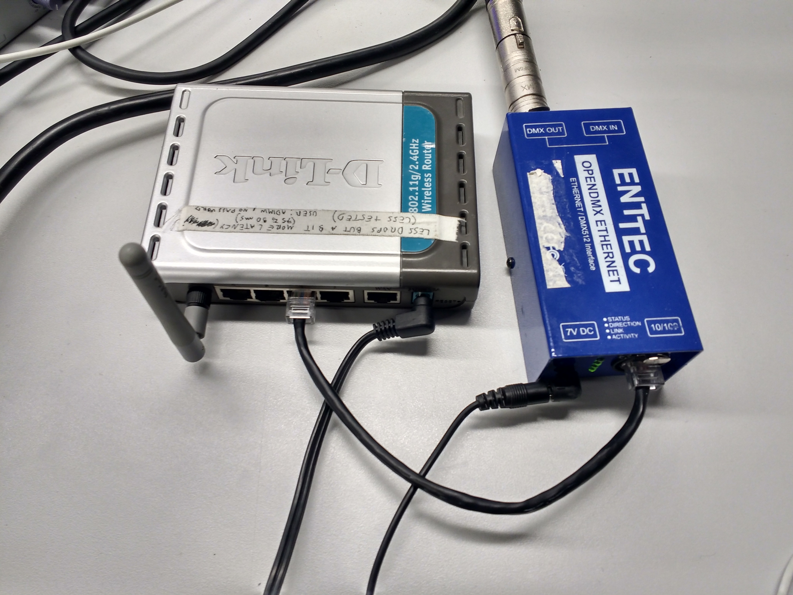
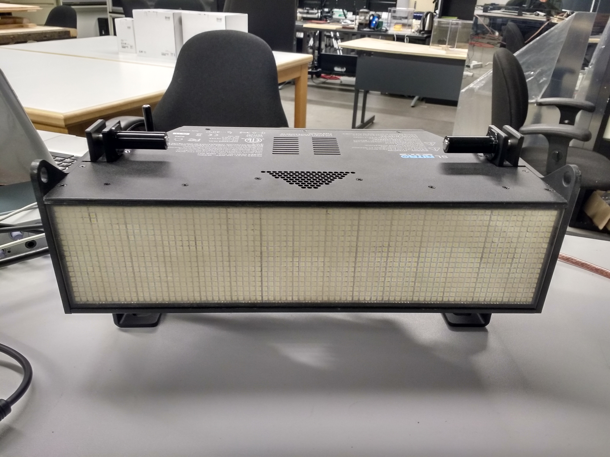
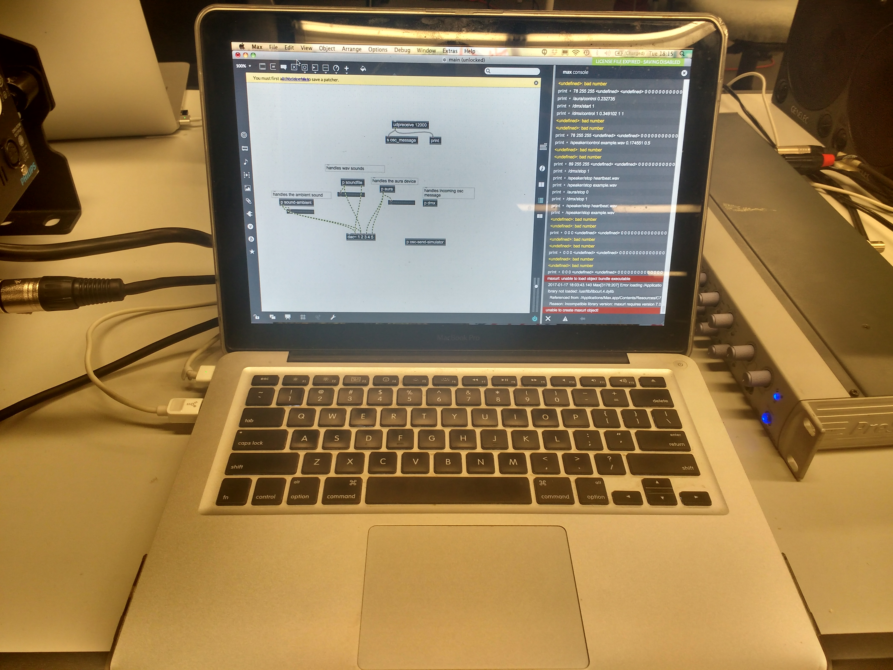

# Server
This server controls wirelessly (via OSC messages) all media used by the prototypes. These are the steps you need to follow for configuring the server:

## Setting up Audio & Haptics

1. Wire up the speakers and the aura to the firestudio. The firestudio should be connected to the computer;

2. Make sure this audio setup is properly configured in your computer before continuing (by using the sound control options of your operating system);

# Setting up router & DMX

1. Connect the DMX strobe to the Enttec device;

2. Connect the Enttec to the D-Link router via an ethernet cable. Make sure your Enttec device is properly configured to run wirelessly via the router. Details about this configuration is available [here](https://d2lsjit0ao211e.cloudfront.net/pdf/manuals/70305.pdf).

3. Make sure the DMX system is properly visible on your local network (e.g. ping the Enttec device) before continuing;

4. Update Enttec's ip inside the file "dmx.maxpat", in the object [imp.artnet.controller @auto 0 @unicast 1 @unicast_ip 192.168.1.120]);

5. You can test if everything is setup fine by sending messages to [s dmx_intensity], [s dmx_rate], and [s dmx_duration] in Max.

# Setting up the server

1. Download the MAX patch for the server (code avaìlable [here](https://github.com/qualified-self/cue-control/tree/master/maxmsp%20server/version%202));

2. Make sure the firestudio is setup to work as default output in MAX (you can do that by double clicking the [dac~] object);

3. Make sure your [dac~] outputs are updated to match whatever configuration you have locally in your firewire (in my case, outputs 2 and 3 are used for the stereo speakers; outputs 4 and 5 are used by the aura device);

4. Everything should be running fine by now. You can make sure the system is properly working by using the controls inside the [p osc-send-simulator] object.

If you any have any question, don't hesitate to contact me (Jeronimo) via email.
