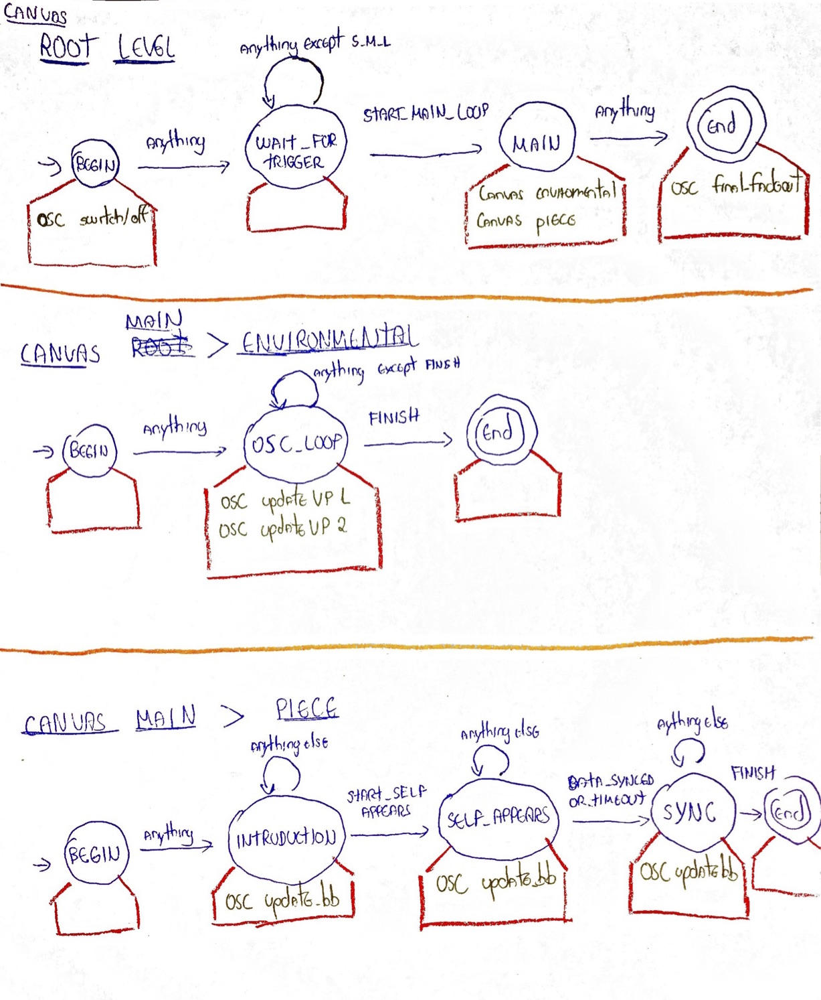
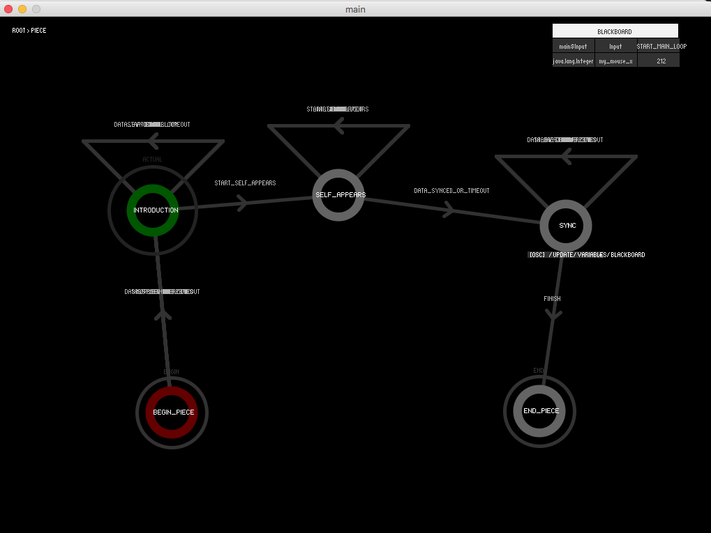

#Scenario 1
Our first scenario implemented in Processing using [Hierarchical Finite State Machines (HFSM)](https://en.wikipedia.org/wiki/UML_state_machine#Hierarchically_nested_states).
 
##Basic behavior
In this prototype, a state machine is represented by a "Canvas". The basic behavior of a Canvas is the same of as in a FSM. 

The only difference relies on the tasks associated to the states. Each "State" (the blue circles in our diagram) has a set of Tasks (the red boxes in our diagram). These tasks run in parallel whenever a state is executed. This allows us to easily implement tasks in parallel (for example, a OSC message could be sent at the same time as an audio is played). 

Tasks can be so far: a) Audio; b) OSC; and c) Other canvas (which allows us to create hierarchy). More (e.g. MIDI, DMX) can be created by extending the abstract class [Task](https://github.com/qualified-self/cue-control/blob/master/prototypes/hsfm_prototype/main/Task.pde).

##Diagram
This diagram was built based on the notes taken by Sofian available [here](https://github.com/qualified-self/documents/blob/master/cue%20trigger%20system/Meeting%20-%20September%2027%202016.md):



##Usage
After designing the HFSM, three steps are necessary. First you need to run the HFSM in the setup by using:

```java
root.run();
```

Second, you need to update the HFSM status in the draw:

```java
root.update_status();
```

Finally, you need to tick the HFSM whenever you want to feed the structure with an input. The possible inputs are defined in a enumerator called "Input". In the following code, the HFSM receives a new input according to the key pressed:

```java
void keyPressed() {
	Input i;
	
    switch(key) {
    case '1':
      i = Input.START_MAIN_LOOP;
      break;
    case '2':
      i = Input.START_SELF_APPEARS;
      break;
    case '3':
      i = Input.DATA_SYNCED_OR_TIMEOUT;
      break;
    case '4':
      i = Input.FINISH;
      break;
    }
	
    root.tick(i);
  }
```

For our first scenario, the defined Inputs are:

```java
public static enum Input {
    START_MAIN_LOOP,
    START_SELF_APPEARS,
    DATA_SYNCED_OR_TIMEOUT,
    FINISH;
}
```

For more details, check the class ["Scenario"](https://github.com/qualified-self/cue-control/blob/master/prototypes/hsfm_prototype/main/Scenario.pde).

##UI
A simple UI was created as follows:



To note:

- Key ' ' executes the demo. The 's' key stops the execution. Keys 'q', 'w', 'e' and 'r' change the input value on the blackboard. Keys '1', '2', and '3' change the state machine which is being currently exhibited;

- A label on the top left represents the State Machine is is being presented in the moment. This label should allow navigation between different state machines (not implemented);

- States are now initialized in a random x/y position, but they can be dragged to whatever position users find convenient;

- Blackboard does not currently support user-defined expressions, but support Java data type. The Blackboard should also be fed according to the received OSC messages. This functionality is not currently implemented;

- Whenever users click on a task, they should see options related to this task (e.g. audio filename and volume to AudioTasks; a previous of the graphics for the sub state machines). This functionality is not currently implemented;

For more info on extended UI possibilities, check [this paper prototype](https://github.com/qualified-self/documents/blob/master/cue%20trigger%20system/interface%20prototypes/prototype1.md).


