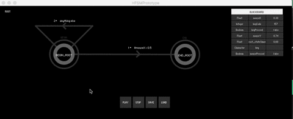
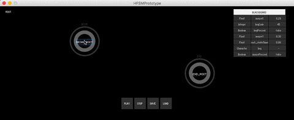
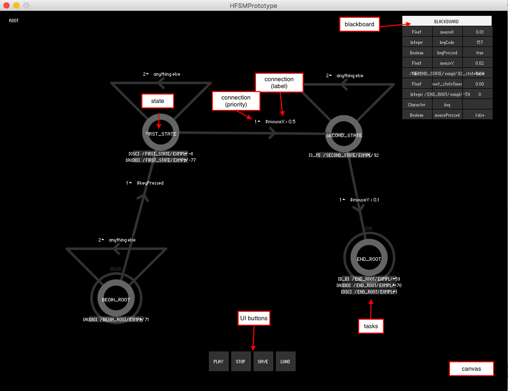

# About
In this prototype, we use [Hierarchical Finite State Machines (HFSM)](https://en.wikipedia.org/wiki/UML_state_machine#Hierarchically_nested_states) as approach to compose immersive multimedia art installations.

For composing, you need to create a set of _States_. These states are connected to one another via logical _Connections_. The execution of the HFSM always starts at the "Begin" state, following these logical connections towards the final the "End" state, where execution halts.

States are composed by a set of _Tasks_. Tasks are the most basic media actions that can happen inside a state (e.g. light, audio, haptics). Whenever a certain state is executed, all tasks associated to it are set to action in parallel.

At any moment, you can use _Blackboard_ variables to enrich your composition (e.g. use the mouse x position to control the volume, or to trigger certain connections).

# Manual
This manual is organized according to functionalities available for each data structure as follows:

## State
Abstract entity that represents a certain time period in the composition. Possible functionalities include:

| Action | Required interaction |
| ------------- | ------------- |
| Add new state | Move the mouse to an empty position on canvas and press the "+" key. |
| Edit state name | Click on a state, and retype its name. |
| Move state | Drag the state using the mouse.|
| Remove state | Move the mouse to a state and press the "-" key. |

## Task
Individual media action that can happen inside a state (e.g. sound, OSC message, DMX control). Possible functionalities include:

| Action | Required interaction |
| ------------- | ------------- |
| Add new task | Move the mouse to a state name and press the "+" key. |
| Edit task | Click on a task. Different options are available depending on the task type. |
| Remove task | Move the mouse to a task and press the "-" key. |

## Connections
A logical condition that—if met—leads to the transition from one state to another.

| Action | Required interaction |
| ------------- | ------------- |
| Add new connection | Hold the "shift" key and drag the initial state towards the destination state. |
| Edit connection | Click on a connection label and retype the new condition (needs to be a logical expression). |
| Change priority | Click on the number on the side of the connection label and chose the new priority. |
| Remove connection | Move the mouse to a connection label and press the "-" key. |

## UI Buttons
Meta actions related to the flow of the state machine:

| Button | Description |
| ------------- | ------------- |
| Play | Executes the current state machine. |
| Stops| Stops the execution of the state machine. |
| Save | Saves the current state machine to a file. |
| Load | Loads a state machine from file. |

## Blackboard
A repository of memory values (i.e. variables) that can be used anywhere in the composition (e.g. conditions, tasks).

No functionalities are available for the blackboard.
