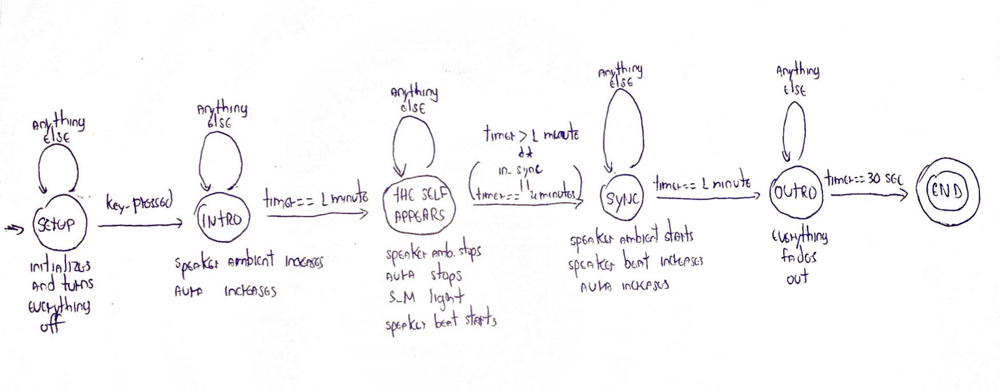

#Scenario 2
This second scenario continues exploring the [Hierarchical Finite State Machines (HFSM)](https://en.wikipedia.org/wiki/UML_state_machine#Hierarchically_nested_states) as defined in [Scenario 1](../scenario1/README.md).

However, the goals here were to investigate:

1. Potential limitations on both models in dealing with the complexities of a real scenario;
2. How to integrate our prototypes with the "output media” (i.e. actuators) used in the piece (light strobes, speakers, etc).

In both cases, we were successful! :) We’ll be making a short video to document this stage.

#Technical Setup
The HFSM prototype is running in a first computer where all input sensors (see below) are connected. A second computer gathers all actuators that can be used in the project (see below). Both communicate to each other via OSC messages in a local network.

##Changes in the prototype (v2)
Major changes since the last prototype include:
- Blackboard now is always listening to OSC messages on port 12001. Any incoming message (ideally from sensors) will be automatically added to the Blackboard;
- Transitions now are logical expressions. In case this logical expression is satisfied, the transition occurs no matter if the state has been concluded or not;

##Input sensors
Currently supported input sensors are:
- BITalino sensors (actually any sensor that can talk OSC is currently supported);
- Mouse & Keyboard;

##Actuators
Currently supported actuators are:
- Haptics: two integrated Aura devices;
- Sound: Two compositions: a regular heartbeat sample and a custom composition.
- Light: One DMX-based strobe;

These actuators are controlled via OSC in a MAX/MSP patch (to be uploaded here).

#The scenario
This new scenario was written by Sofian. It is presented [here](https://github.com/qualified-self/documents/blob/master/cue-trigger-system/Scenarios.md). My corresponding HFSM structure is implemented as follows:

(still missing pictures of the sub state machines)

#The UI
The UI has changed a little bit since the first scenario. Follows a screenshot:

